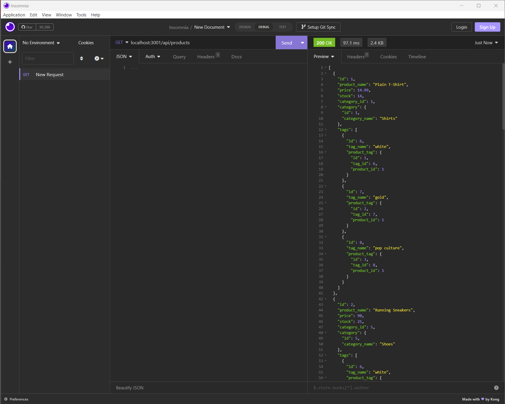

# E-Commerce BackEnd

## Steps
Do NPM install
Source the db/schema.sql
run the seed 
then npm run start

## Project Description:
This app is to keep track of the company's files inventory in a categoric sorting and product identification

## Link For Video
https://drive.google.com/file/d/1GfqzO1LuP-r7c4qULUYgC5pTdeMzmapz/view?usp=sharing

## Sample Photo

